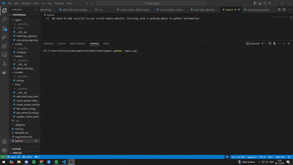

# TaskForgeAI
<div align="center">
  
</div>

<br>

# TaskForgeAI

In modern project management, accurately breaking down high-level tasks into smaller, actionable subtasks and estimating their time is crucial for efficient planning and resource allocation. 

To address this challenge, this project aims to develop an intelligent agent capable of automating the task decomposition process. Given a high-level task from a file source, the agent will break it down into smaller subtasks, estimate the time and cost required for each subtask, and leverage tools to gather relevant information for these estimations. The agent will further integrate with GitHub Projects to create and organize the subtasks, enabling seamless tracking and collaboration.

## Setup

Install the Python dependencies.

```bash
pip install -r requirements.txt
```

Create your own .env file in the root of the project, and give it the following API-keys: 
```
GITHUB_API_KEY=YOUR_KEY
OPENAI_API_KEY=YOUR_KEY
```

To get the GITHUB_API_KEY, go to: https://github.com/settings/tokens and create a Personal Access Token (PAT) or use an existing one.

To get the OPENAI_API_KEY, go to: https://console.mistral.ai/api-keys/ and create a new API Key or use an existing one.

## Run the agent

Run the main.py file:
```bash
python .\main.py
```

## Requirements

- Python 3.10+ (3.12 preferred)
- autogen
- ollama
- fix-busted-json
- requests
- python-dotenv
- mistralai
- autogen-agentchat @ git+https://github.com/patrickstolc/autogen.git@0.2#egg=autogen-agentchat (custom fix for ratelimiting using the free Mistral AI)

## Input


## Output

## Example

